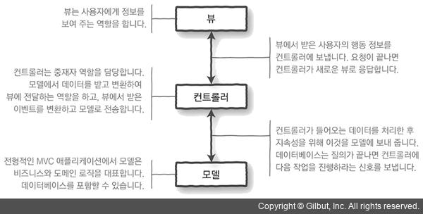

## [1Week] 이상제
## 미션 요구사항 분석 & 체크리스트

---

### 단계별 요구사항(필수 미션)
- [x] 1단계 : 종료 기능 구현
- [x] 2단계 : 등록 기능 구현
- [x] 3단계 : 등록시 생성된 명언번호 노출
- [x] 4단계 : 등록마다 생성 명언번호 증가
- [x] 5단계 : 명언 목록 조회 기능 구현
- [x] 6단계 : 명언 삭제 기능 구현
- [x] 7단계 : 미존재 명언 삭제에 대한 예외처리
- [x] 8단계 : 명언 수정
---
### 단계별 요구사항(선택 미션)
- [x] 9단계 : 파일을 통한 영속성 부여
- [x] 10단계 : `data.json` 빌드(양식 충족)
- [ ] 11단계 : `SimpleDBTest.java` 의 모든 테스트케이스 만족 기능 구현
- [ ] 12단계 : 파일 영속성 관련 기능 제거, `SimpleDB`를 통한 명언 정보 DB 저장
- [ ] 13단계 : `@Configuration` `@Bean` `@Component` 이용 의존성 주입기능 구현
- [ ] 14단계 : 13단계 적용, 생성자 주입, `@Autowired`

## N주차 미션 요약

----
### 접근 방법 

* [x] `TDD` 기반의 단계적 기능 구현
  * [구현 이전 TDD 기반 스캐너 구현 예제 실습](https://www.scode.gg/p/13138)
* [x] `Model, View, Controller` 패턴을 준용한 구현    
  
* [x] `data.json` 파일을 활용한 불러오기와 저장이 가능하게 구현

---
### 특이사항

```
1. 아쉬웠던 점 / 궁금했던 점
  1) JDBC 관련 환경설정
  2) JDBC 활용 CRUD 구현 시 id 중복여부 확인을 통한 CREATE / UPDATE 판별법 

1. 참고 : [Refactoring] 
  1) 스트림을 활용한 리팩토링
  2) 보다 가독성 있는 메소드 이름으로 리팩토링
  3) MVC 패턴에 대한 검증
```